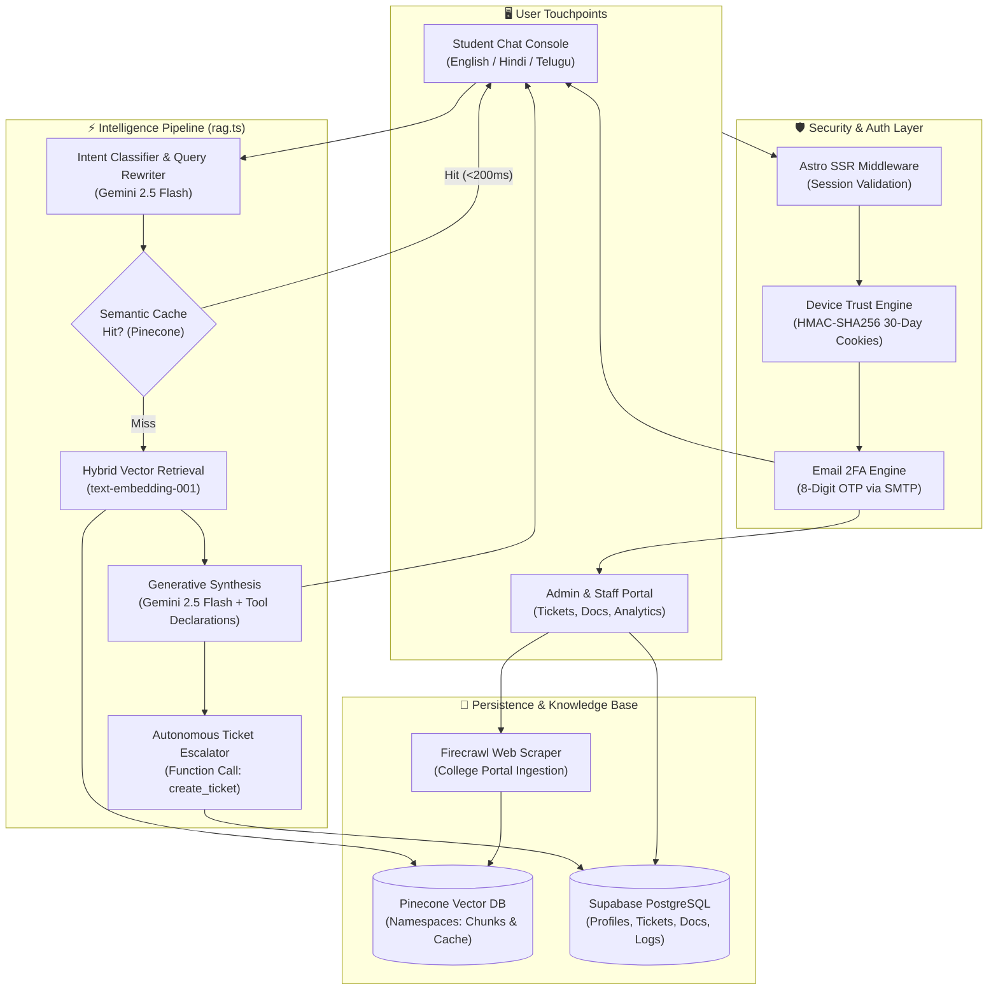

<div align="center">

# 🎓 DeskMate 2.0
### *Every answer. Every source. Every time.*

**The Autonomous Campus Intelligence & Knowledge Operations Platform**  
*Transforming institutional college documents into real-time, zero-hallucination answers, verified source citations, and automated staff escalations.*

---

[](https://astro.build)
[](https://ai.google.dev/)
[](https://www.pinecone.io/)
[](https://supabase.com/)
[](https://tailwindcss.com/)
[](https://www.typescriptlang.org/)
[](https://opensource.org/licenses/MIT)

[Explore Features](#-key-features) • [System Architecture](#-system-architecture) • [Getting Started](#-getting-started) • [Environment Setup](#-environment-variables) • [Role Workflows](#-role-based-access--features)

</div>

---

## 🌟 Executive Overview

**DeskMate 2.0** is an enterprise-grade academic AI assistant designed to eliminate bureaucratic bottlenecks across universities and higher education institutions. Rather than relying on static FAQs or generic chatbots that hallucinate, DeskMate ingests official college documentation (syllabi, examination schedules, fee circulars, hostel handbooks, regulatory notices) and serves strictly grounded, page-cited answers with sub-second latency.

Equipped with **multi-agent orchestration**, **autonomous support ticketing**, **multilingual fluency (English, Hindi, Telugu)**, and an **executive administrative command center**, DeskMate unifies students, faculty, and campus administrators into a single high-security ecosystem.

---

## ✨ Key Features

### 🧠 1. Zero-Hallucination Retrieval Augmented Generation (RAG)
- **Strict Grounding**: Answers are synthesized exclusively from official college PDFs, DOCX files, and scraped web circulars. If a document doesn't confirm it, DeskMate refuses to speculate.
- **Page-Level Attribution**: Every answer renders clickable citation badges highlighting the source file, specific page number, and relevant excerpt.
- **Context-Aware Query Rewriting**: Expands ambiguous student questions (e.g., *"when is it due?"* $\rightarrow$ *"What is the deadline for 3rd semester tuition fee payment 2024-25?"*).

### ⚡ 2. High-Performance Semantic Caching
- **Sub-200ms Response Times**: Leverages Pinecone vector similarity clustering in an isolated `semantic_cache` namespace.
- **Cost & Latency Optimization**: Frequent campus queries (*"how to apply for bus pass"*, *"hostel curfew timings"*) are served directly from the semantic cache without re-prompting the LLM.

### 🌐 3. Trilingual Campus Inclusivity
- **Multi-Language Support**: Complete conversational comprehension and generation in **English**, **Hindi (हिंदी)**, and **Telugu (తెలుగు)**.
- **Language Preservation**: Respects regional student languages and responds naturally with technical college terminology preserved.

### 🎫 4. Autonomous Support Escalation & Ticketing
- **AI Tool Calling (`create_ticket`)**: Powered by Gemini 2.5 Flash function declarations.
- **Automated Escalation**: When a student encounters a personal roadblock (e.g., payment deductions, hall ticket discrepancies, hostel room repairs), DeskMate autonomously creates a tracked departmental support ticket and routes it directly to responsible staff with WhatsApp and email contact cards.

### 🔐 5. Enterprise Security & 30-Day Device Trust (2FA)
- **Email Two-Factor Authentication**: Every login from an unrecognized device triggers an 8-digit OTP dispatched through Gmail SMTP.
- **Cryptographic Device Trust Engine**: Verified browsers can opt to *"Trust this device for 30 days"*, issuing an HTTP-only, HMAC-SHA256 signed tamper-proof cookie (`deskmate_trusted_device`). Incognito windows and new devices are always challenged.
- **Role Isolation**: Strict Row-Level Security (RLS) and middleware gating for `student`, `staff`, and `admin` roles.
- **Access Code Onboarding**: Cryptographically verified 8-character college codes for staff and `ADM-...` codes for administrators.

### 📊 6. Comprehensive Admin Command Suite
- **Document Management Studio**: Upload multi-format documents, inspect chunk segmentations, trigger automated Firecrawl web scrapers, and re-index embeddings.
- **Unified Account Governance**: Real-time student & staff account oversight with instant one-click activation/deactivation.
- **Departmental Ticketing Queue**: Filter tickets by department, urgency level, and resolution lifecycle.
- **Live Campus Analytics**: Real-time tracking of token usage, peak query hours, unanswerable queries, and popular campus topics.
- **Broadcast Announcements**: Publish priority banners that appear natively in the student AI chat console.

---

## 🏗️ System Architecture



---

## 👥 Role-Based Access & Features

| Capability | 🎓 Student | 👨‍🏫 Staff | 👑 College Admin |
|:---|:---:|:---:|:---:|
| **Zero-Hallucination AI Chat** | ✅ Full Access | ✅ Full Access | ✅ Full Access |
| **Exact Document & Page Citations** | ✅ Included | ✅ Included | ✅ Included |
| **Personal Ticket Creation & History** | ✅ Self | ✅ Departmental | ✅ Campus-wide |
| **Two-Factor Authentication (2FA)** | ✅ Enforced | ✅ Enforced | ✅ Enforced |
| **30-Day Device Trust Bypass** | ✅ Optional | ✅ Optional | ✅ Optional |
| **Departmental Ticket Resolution** | ❌ | ✅ Assigned Only | ✅ Full Control |
| **Document Ingestion & Web Scraping** | ❌ | ❌ | ✅ Full Control |
| **Staff & Student Account Moderation** | ❌ | ❌ | ✅ Instant Toggle |
| **Access Code Management** | ❌ | ❌ | ✅ Generate & Revoke |
| **Campus Analytics & Announcement Publishing** | ❌ | ❌ | ✅ Full Access |

---

## 🛠️ Technology Stack

```
DeskMate 2.0
├── 🚀 Application Framework : Astro 5.0 (Server-Side Rendered on Node/Vercel)
├── 🎨 Styling & Animation    : Tailwind CSS 3.4, Vanilla CSS, Lenis Smooth Scroll, Swiper
├── 🧠 LLM Engine             : Google Gemini 2.5 Flash (@google/genai SDK)
├── 📐 Embeddings Model       : Google text-embedding-001 (768-dimensional vectors)
├── 🌲 Vector Database        : Pinecone 7.1 (Namespaces: default, semantic_cache)
├── 🗄️ Relational Database    : Supabase (PostgreSQL 15 with Row Level Security)
├── 🔐 Authentication         : Supabase Auth SSR + Custom HMAC-SHA256 2FA Token Engine
├── 🕷️ Web Scraping Engine    : Firecrawl API v1
├── 📄 Document Processors    : Mammoth (DOCX), Custom PDF Parser & Overlapping Chunk Engine
└── 🛡️ Code Quality & Types   : TypeScript 5.4, Astro Check, Strict Mode
```

---

## 📁 Repository Structure

```tree
Positivus/
├── public/                     # Static assets, campus banners, and illustrations
├── src/
│   ├── components/             # Reusable UI components
│   │   ├── admin/              # Admin widgets, Document Cards, Ticket Cards
│   │   ├── chat/               # ChatInterface.astro (student conversation console)
│   │   ├── forms/              # Accessible form fields & controls
│   │   └── ui/                 # Navbar, Footers, Section Headers, Badges
│   ├── layouts/
│   │   ├── AdminLayout.astro   # Dedicated layout for staff & admin dashboard
│   │   ├── AuthLayout.astro    # Split-screen authenticated layout
│   │   └── MainLayout.astro    # Public landing page layout
│   ├── lib/                    # Core business logic & SDK initializers
│   │   ├── cache.ts            # High-speed semantic caching utilities
│   │   ├── device-trust.ts     # HMAC-SHA256 30-day device fingerprinting & 2FA tokens
│   │   ├── gemini.ts           # Google GenAI client, Gemini 2.5 Flash & tool configs
│   │   ├── pinecone.ts         # Vector index queries, upserts, & namespace handling
│   │   ├── rag.ts              # Intent classification, query rewriting, citations & RAG
│   │   └── supabase.ts         # Server-side Supabase client with cookie session bridge
│   ├── middleware.ts           # Global route gating, role guards, & auth redirects
│   ├── pages/
│   │   ├── api/                # REST endpoints
│   │   │   ├── admin/          # Documents, analytics, tickets, staff, scraper API
│   │   │   ├── auth/           # Login, signup, 2FA verify, 2FA resend, password reset
│   │   │   └── chat/           # RAG inference generation stream endpoint
│   │   ├── app/                # Authenticated application views
│   │   │   ├── admin/          # Admin index, documents, staff, accounts, analytics
│   │   │   ├── chat.astro      # Primary student conversational portal
│   │   │   └── tickets.astro   # Student ticket tracking console
│   │   ├── forgot-password.astro # 6-digit OTP password reset workflow
│   │   ├── login.astro         # 2-step credential + 2FA login with 30-day trust
│   │   └── signup.astro        # Student & Staff onboarding with college access codes
│   └── styles/
│       └── global.css          # Design system tokens, typography & dark mode styles
├── supabase/
│   └── migrations/             # SQL migrations for RBAC, access codes, & ticketing
├── astro.config.mjs            # Astro build & SSR configuration
├── package.json                # Project dependencies and operational scripts
└── tailwind.config.cjs         # Color palettes, custom radii, font families
```

---

## 🚀 Getting Started

### Prerequisites

Ensure you have the following installed:
- **Node.js**: `v18.17.0` or higher
- **npm** or **pnpm**
- **Git**
- Accounts for:
  - [Google AI Studio](https://aistudio.google.com/) (Gemini API Key)
  - [Pinecone Console](https://app.pinecone.io/) (Vector Index)
  - [Supabase](https://supabase.com/) (Database & Auth)
  - [Firecrawl](https://www.firecrawl.dev/) (Web Scraping API)

### 1. Clone the Repository

```bash
git clone https://github.com/vinay622/Deskmate-final.git
cd Deskmate-final
```

### 2. Install Dependencies

```bash
npm install
```

### 3. Configure Environment Variables

Create a `.env` file in the root directory:

```ini
# Supabase Configuration
PUBLIC_SUPABASE_URL="https://your-project-id.supabase.co"
PUBLIC_SUPABASE_ANON_KEY="your-anon-key"

# AI & LLM Engine (Google Gemini)
GEMINI_API_KEY="your-google-ai-studio-gemini-api-key"

# Vector Database (Pinecone)
PINECONE_API_KEY="your-pinecone-api-key"
PINECONE_INDEX="deskmate-2"

# Web Scraping Engine (Firecrawl)
FIRECRAWL_API_KEY="your-firecrawl-api-key"

# Secret Key for HMAC-SHA256 2FA & 30-Day Device Trust Token Signing
AUTH_SECRET="your-super-strong-random-hex-secret-key"
```

### 4. Database Setup

Apply the SQL migration scripts in your **Supabase SQL Editor**:
1. Run `supabase/migrations/20260930000000_admin_access_codes_and_staff_role.sql`
2. Run `supabase/migrations/20261001000000_update_staff_access_codes_8chars.sql`

Configure your **Magic Link Email Template** in Supabase (`Authentication` > `Email Templates` > `Magic Link`):
```html
<h2>Your DeskMate 2FA Verification Code</h2>
<p>Use the following 8-digit verification code to complete your login:</p>
<h1 style="background: #f4f4f5; padding: 12px 24px; font-family: monospace; letter-spacing: 4px; display: inline-block; border-radius: 8px;">
  {{ .Token }}
</h1>
<p style="color: #666; font-size: 13px;">This code expires in 5 minutes. If you did not attempt to sign in, please secure your account immediately.</p>
```

### 5. Launch the Development Server

```bash
npm run dev
```

Visit **`http://localhost:4321`** in your browser.

---

## 🔒 Security Best Practices

- **Zero Client-Side Secrets**: All Gemini, Pinecone, and Firecrawl API interactions occur exclusively on the Astro SSR server runtime.
- **Stateless 2FA Credential Gate**: Factor 1 (password verification) is validated statelessly; Supabase authentication session cookies are never issued until Factor 2 (email OTP) or a cryptographically verified 30-day device token passes.
- **Row-Level Security (RLS)**: Profiles, tickets, and college documents enforce strict tenancy checks preventing cross-institution data leaks.
- **Sanitized Upload Ingestion**: All incoming administrative documents undergo MIME-type filtering, text token sanitization, and isolated chunk indexing.

---

## 🤝 Contributing

Contributions make the open-source community thrive! If you'd like to improve DeskMate:

1. **Fork the Project**
2. **Create your Feature Branch** (`git checkout -b feature/AmazingFeature`)
3. **Commit your Changes** (`git commit -m 'feat: Add some AmazingFeature'`)
4. **Push to the Branch** (`git push origin feature/AmazingFeature`)
5. **Open a Pull Request**

---

## 📜 License

Distributed under the **MIT License**. See [`LICENSE`](LICENSE) for more information.

---

<div align="center">
  <sub>Crafted with ❤️ for colleges, educators, and students everywhere. Powered by <strong>DeskMate 2.0</strong>.</sub>
</div>
